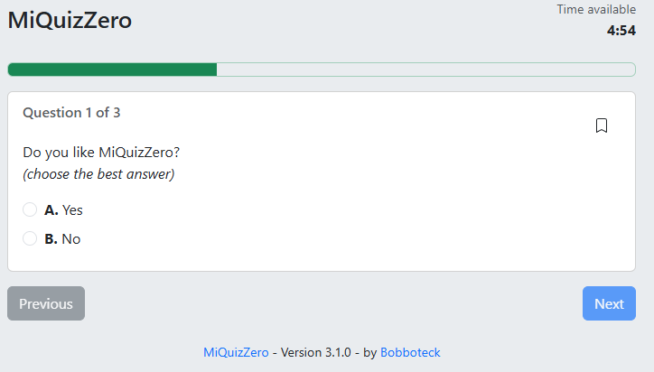
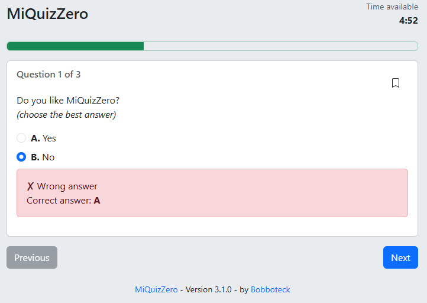
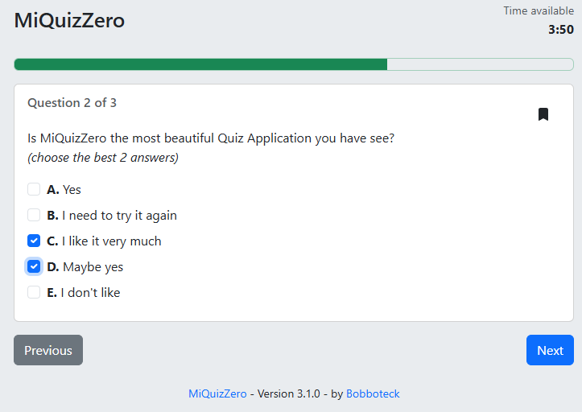
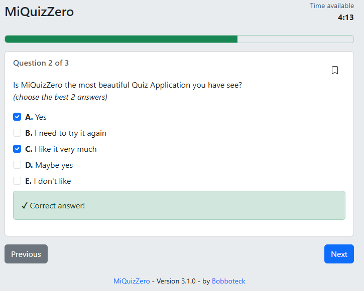
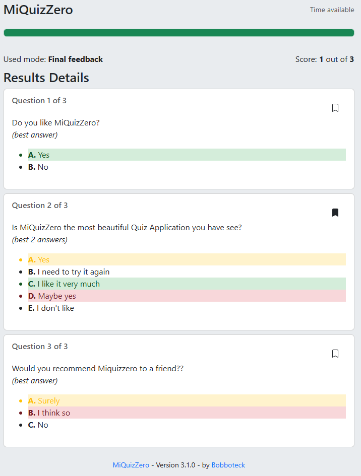

# MiQuizZero

MiQuizZero è un'applicazione per testare le proprie capacità, con dei quiz personalizzati.
Il nome è un'assonanza con la frase "io faccio un quiz per mettermi alla prova".

## How to use

The application can be used on a computer or mobile device, and you can also "install" it on the device.
You need to download the [quiz-data.json](https://raw.githubusercontent.com/bobboteck/miquizzero/refs/heads/master/quiz-data.json) file locally and load it from the interface.
You can use the sample file as a basis for creating your own quiz file. I'll be working on a specific Editor soon.

### Start screen

When you load the application ...

### Question type

MiQuizZero manages multiple choice questions, in two modes of use.
A question that has two or more answers, of which only one is correct.

Same mode but with direct feedback.

A question that has two or more answers, where more than one answer is correct.

Same mode but with direct feedback.

### Final result

In the Result detail MiQuizZero show for each question, it shows the answers given, highlighting the correct ones (green), the incorrect ones (red) and the missed ones (yellow).
Bookmarked questions during the quiz are also highlighted.

## How to contribute

You can contribute by opening issues for reports or suggestions, writing code to improve the application, or simply giving the project a star.
